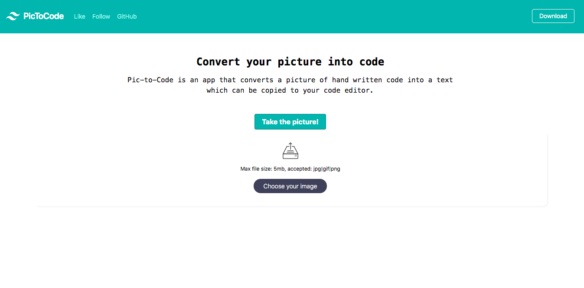

<h1 align=center> **Pic-To-Code App** </h1>

[](https://github.com/RichardLitt/standard-readme)
[](https://david-dm.org/dwyl/esta)

 An app that converts a picture of hand written code into text
which can be copied to your code editor

A hackathon project meant to be submitted within 50 hours




## Background

- HTML
- Javascript
- React
- Tailwind css
- Google cloud API
- Jest
- axios

## Demo
 Check out the live demo of the project. [Click](https://adoring-meitner-cafe65.netlify.app/)

## Usage
> Clone the repository to your local machine

```sh
$ git clone https://github.com/Elukoye/PicToCode.git
```

> cd into the directory

```sh
$ cd PicToCode
```


`npm install` 
<br /> to install all the dependencies that are needed

`npm start` <br/> to start the local server which will open a new tap on your default browser 


## Maintainers 

1. Okike Bright – [@b_okike](https://twitter.com/b_okike) – brightokike@gmail.com
2. Emogene Lukoye – [@Elukoye](https://www.linkedin.com/in/eelukoye/) – lukoyedith@gmail.com
3. Radouane Khiri – [@redvanisation](https://twitter.com/redvanisation) –  Radouanekhiri@gmail.com
4. Murilo Roque  – [@MuriloRoquePai1](https://twitter.com/MuriloRoquePai1) – muriloengqui@gmail.com
5. Macbright - [https://github.com/macbright/github-link](https://github.com/macbright)


## Contributing

1. Fork it https://github.com/Elukoye/PicToCode.git/fork)
2. Create your feature branch (git checkout -b feature/[choose-a-name])
3. Commit your changes (git commit -am 'What this commit will fix/add')
4. Push to the branch (git push origin feature/[chosen name])
5. Create a new Pull Request

## License

The JavaScript Templates script is released under the
[MIT license](https://opensource.org/licenses/MIT).
